# TP1DPBO2526C2

## JANJI
Saya Muhammad Hanif Muyassar dengan NIM 2510593 mengerjakan Tugas Praktikum 1 dalam mata kuliah Desain dan Pemrograman Berorientasi Objek untuk keberkahanNya maka saya tidak melakukan kecurangan seperti yang telah dispesifikasikan. Aamiin.

## FITUR UTAMA (CRUD)
- Tambah Data: Menambah objek baru.
- Tampilkan Data: Menampilkan semua objek yang tersimpan.
- Update Data: Mengubah data objek berdasarkan identifier unik (seperti ID).
- Hapus Data: Menghapus objek berdasarkan identifier unik (ID).
- Cari Data: Mencari satu objek spesifik.

## Error Handling di semua program
- ID tidak boleh kosong, dan input akan diminta ulang sampai diisi. 
  

- ID yang baru tidak boleh duplikat dengan ID yang sudah ada. 
  

- Durasi wajib berupa angka; kalau bukan angka, program meminta input ulang. 
  

- Durasi minimal 40 menit, dan tahun rilis harus berada di rentang 1895–2026 (1895 dipilih karena itu tahun pemutaran komersial film pertama oleh Lumière bersaudara). 
  

- Pilihan menu yang tidak tersedia (misal mengetik angka di luar 0–5) akan ditolak tanpa menutup program. 
  

## DOKUMENTASI OUTPUT
Program dapat menambahkan, menampilkan, memperbarui, menghapus, dan mencari data film.

## Output program C++
### Menambahkan data
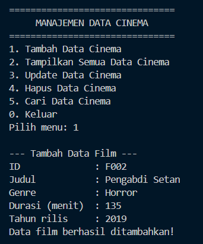

### Menampilkan semua data
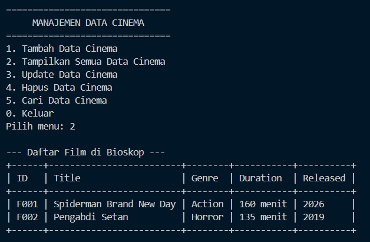

### Memperbarui data
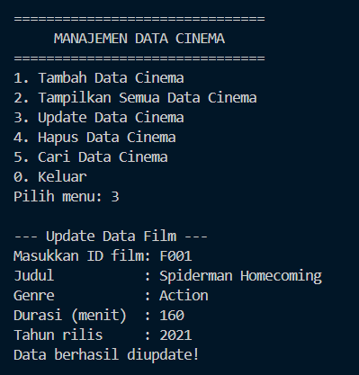

### Mencari film
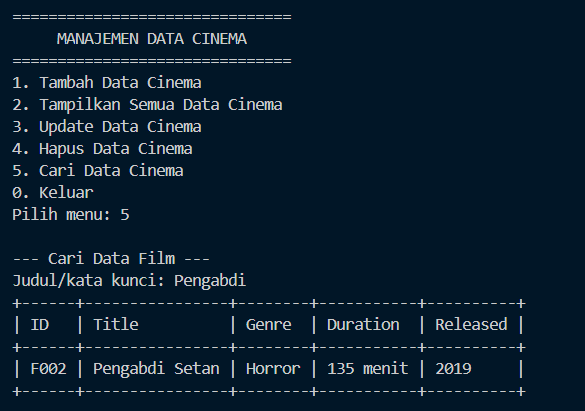

### Menghapus data
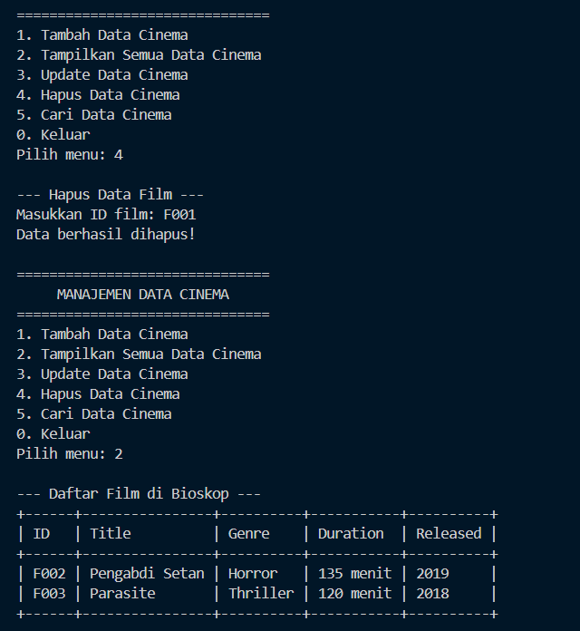

## Output program Java
### Menambahkan data
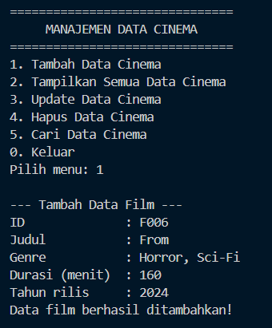

### Menampilkan semua data
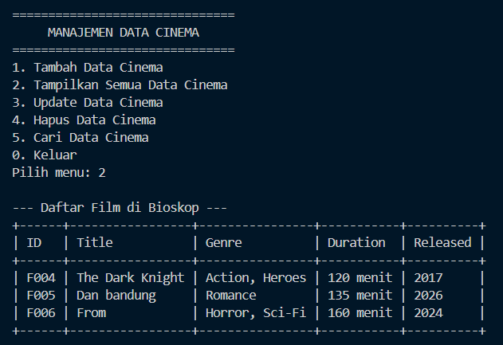

### Memperbarui data
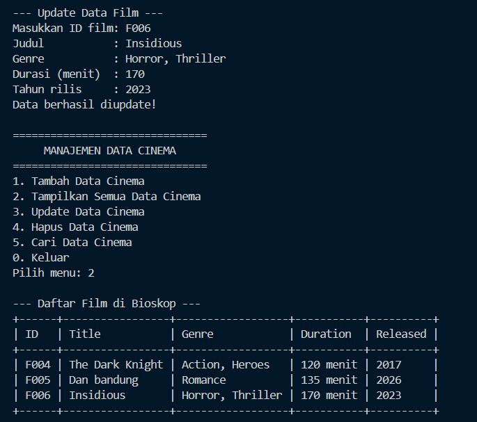

### Mencari film
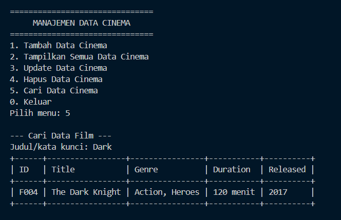

### Menghapus data
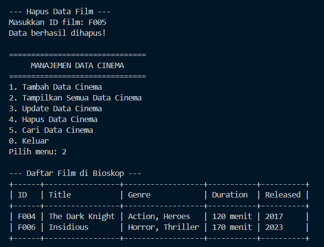

## Output program Python
### Menambahkan data
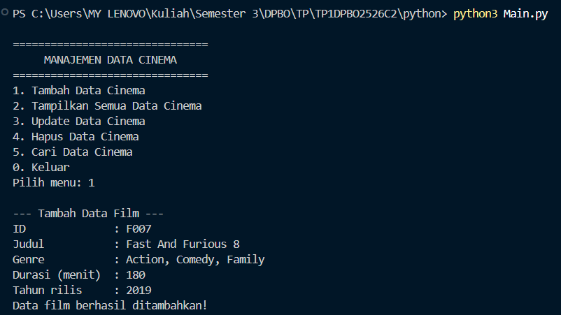

### Menampilkan semua data
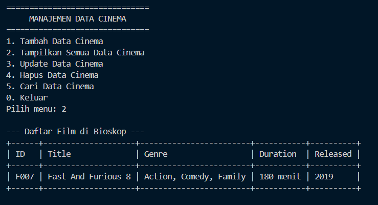

### Memperbarui data
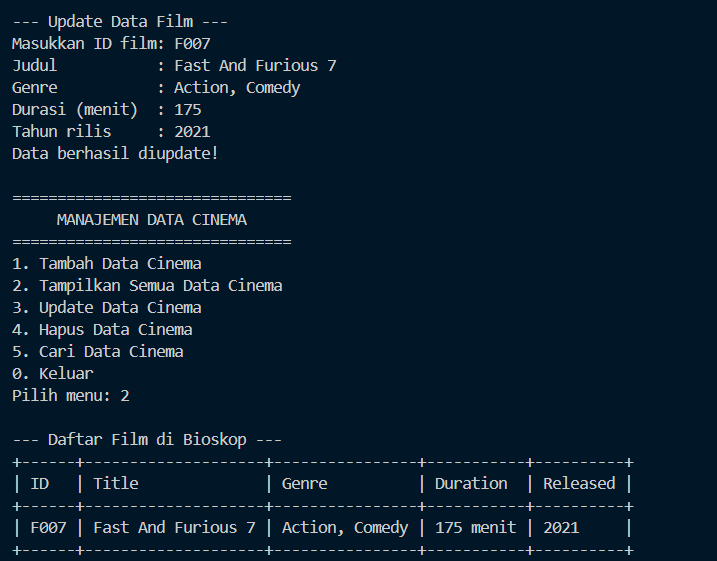

### Mencari film
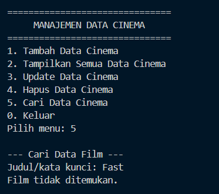

### Menghapus data
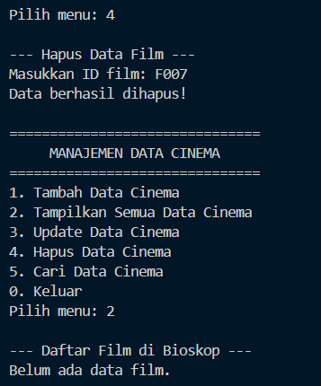

## Output program PHP
### Tampilan awal
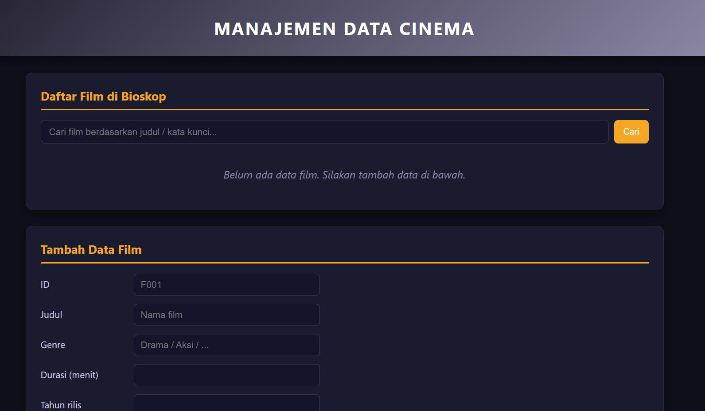

### Menambahkan data
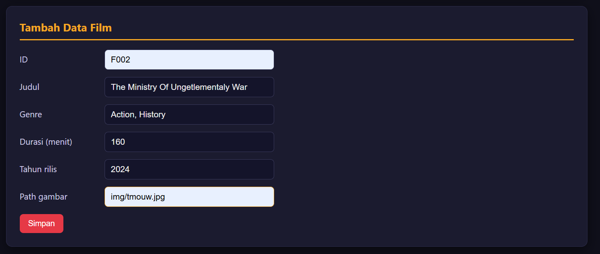

### Menampilkan semua data
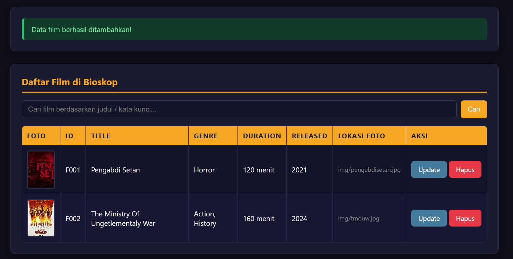

### Memperbarui data
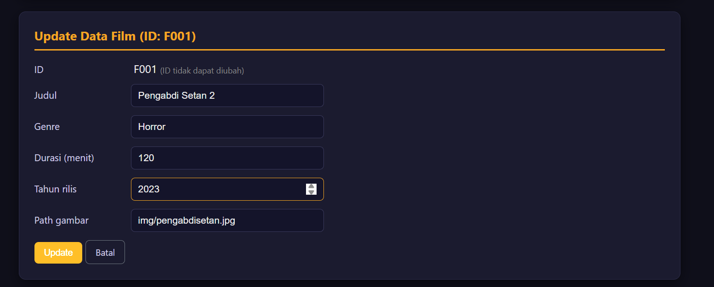
 
Hasil setelah update: 
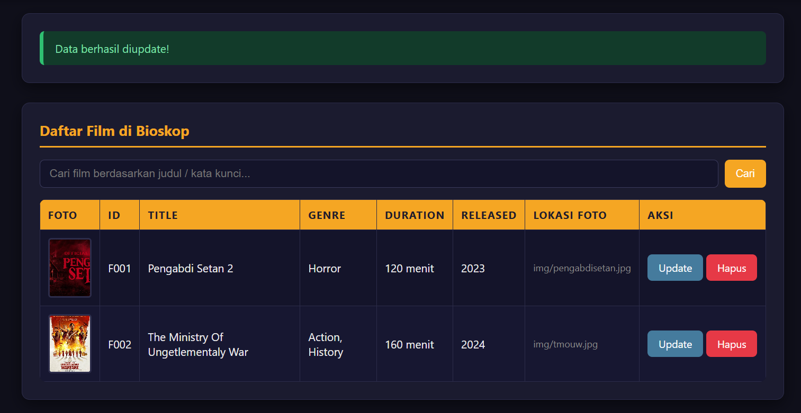

### Mencari film
Pencarian bersifat *case-insensitive* (huruf besar/kecil dianggap sama). 
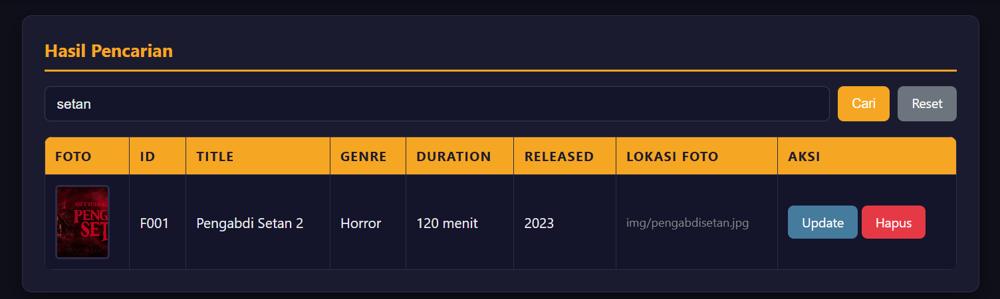

### Menghapus data
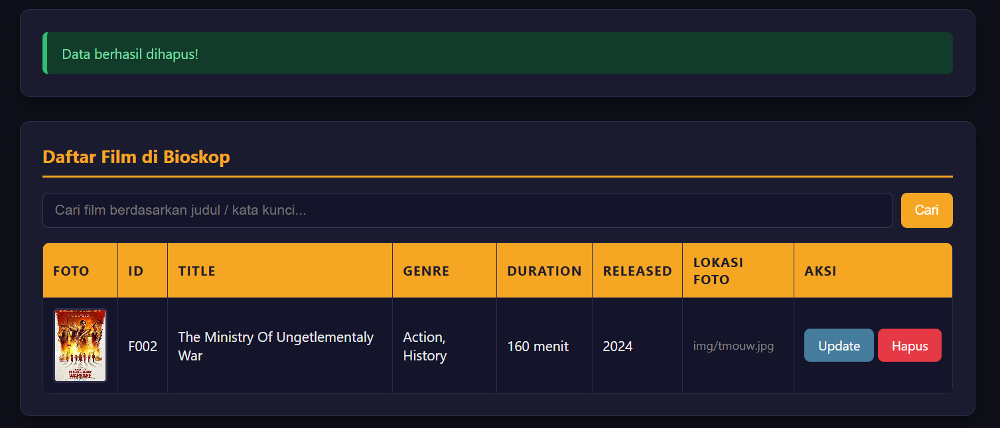

---

## Cara Menjalankan

| Bahasa | Perintah |
|---|---|
| C++ | `g++ -std=c++17 -pthread -o cinema cpp/Main.cpp` lalu `./cinema` |
| Java | `javac java/Cinema.java java/Main.java` lalu `java -cp java Main` |
| Python | `python python/Main.py` |
| PHP | `php -S localhost:8000` di folder `php/`, buka `http://localhost:8000/index.php` |

